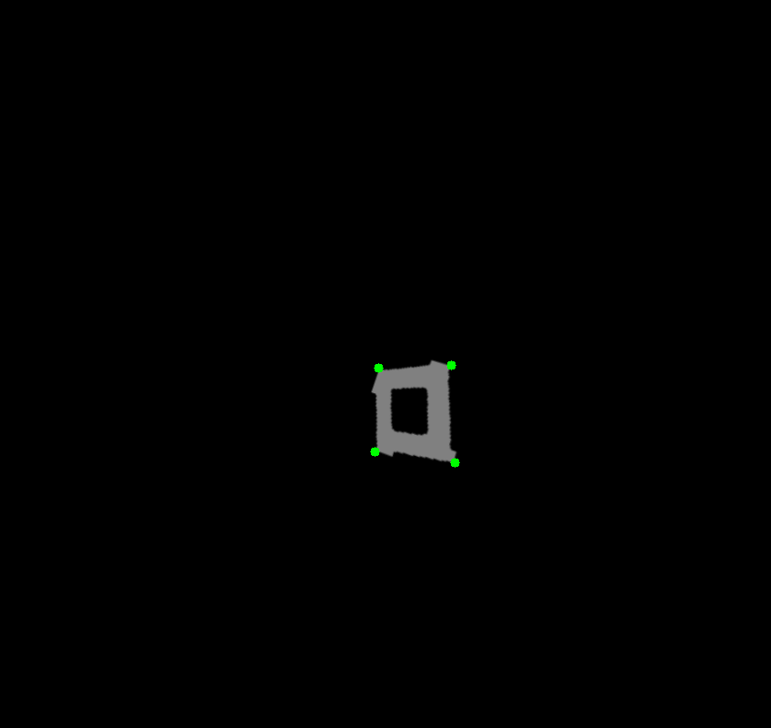
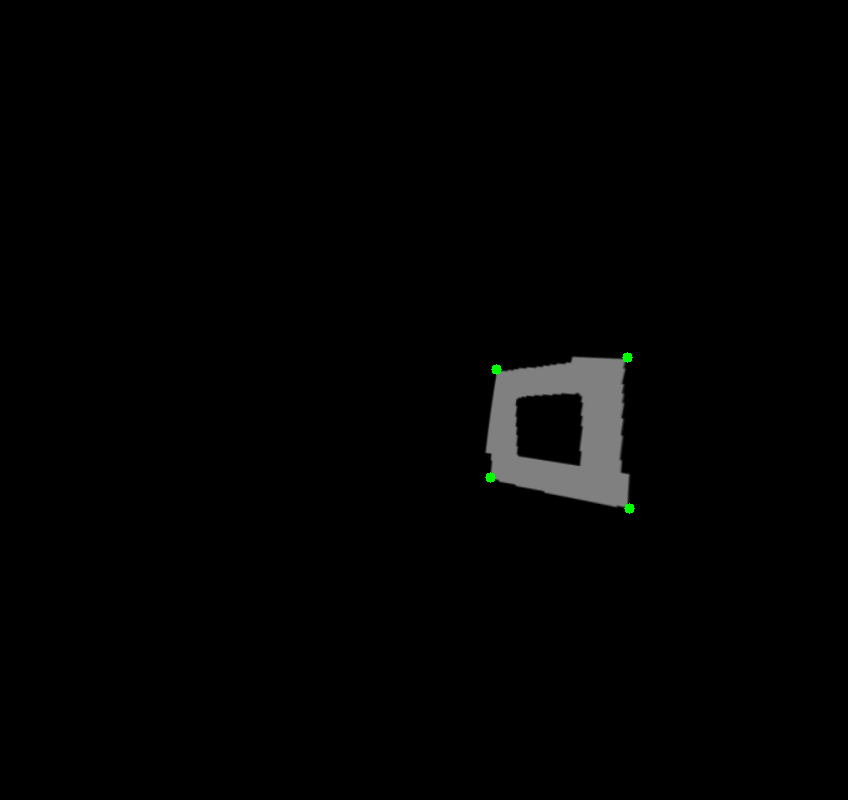
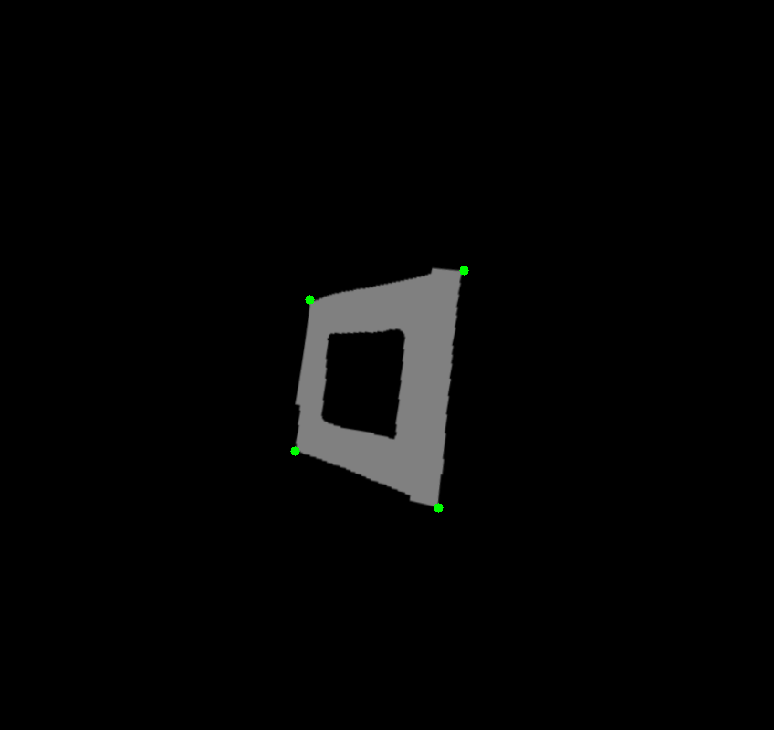
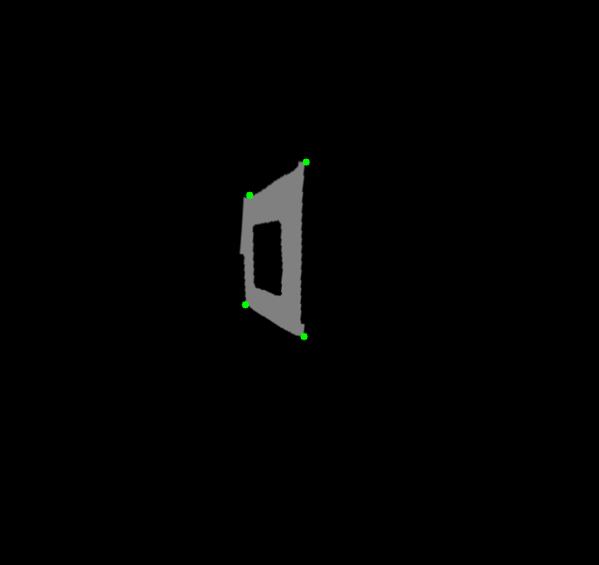

# SnakeGate

Corner detection algorithm designed to precisely locate corner points for segmented gate images in drone racing. 

### Build Project with CMake
```
mkdir build
cd build
cmake ..
make
```

### Run Snake Gate
After building the project
```
cd build
./snake_gate
```

### Run Snake Gate with corner refinement
```
cd build
./snake_gate_cr
```

## Results
### Snake Gate with Corner Refinement

<p align="center">
  
  
  
  
</p>

